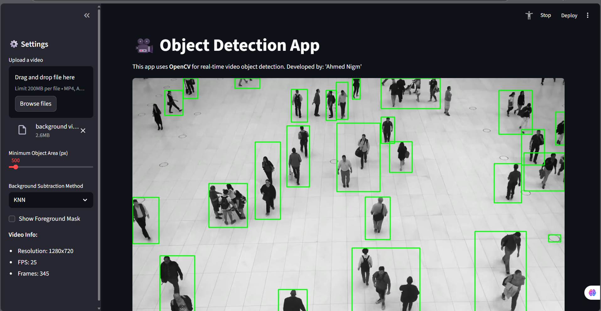

# 🎥 Object Detection App

A real-time video object detection application built with Streamlit and OpenCV. This app allows users to upload videos and detect moving objects using advanced background subtraction techniques.



## 📋 Features

- **Multi-format Video Support**: Supports MP4, AVI, MOV, WMV, FLV, MKV, WebM, and MPEG formats
- **Advanced Background Subtraction**: Choose between MOG2 and KNN algorithms
- **Real-time Processing**: Live video processing with progress tracking
- **Interactive Controls**: Adjustable minimum object area threshold
- **Dual View Mode**: Option to display both original video and foreground mask
- **Object Counting**: Automatic counting of detected objects
- **Video Download**: Download the original uploaded video

## 🚀 Demo

The app provides an intuitive interface where users can:
1. Upload a video file
2. Adjust detection parameters
3. Select background subtraction method
4. View real-time object detection results
5. Monitor processing progress and statistics

## 🛠️ Installation

### Prerequisites

- Python 3.8 or higher
- pip package manager

## ⚙️ Configuration Options

| Parameter | Description | Default | Range |
|-----------|-------------|---------|-------|
| Minimum Object Area | Minimum pixel area for object detection | 500 px | 100-5000 px |
| Background Method | Algorithm for background subtraction | MOG2 | MOG2, KNN |
| Show Mask | Display foreground mask alongside video | False | True/False |

## 🧠 Background Subtraction Methods

### MOG2 (Mixture of Gaussians)
- Adaptive background model
- Good for scenes with gradual lighting changes
- Handles shadows effectively

### KNN (K-Nearest Neighbors)
- More robust to sudden illumination changes
- Better performance in dynamic environments
- Higher computational requirements

## 📁 Project Structure

```
object-detection-app/
│
├── Object_Tracking.py      # Main application file
├── README.md              # Project documentation
├── requirements.txt       # Python dependencies
└── assets/               # Screenshots and demo files
    └── demo.gif
```

## 🔧 Technical Details

- **Framework**: Streamlit for web interface
- **Computer Vision**: OpenCV for video processing and object detection
- **Algorithm**: Background subtraction with contour detection
- **Supported Formats**: MP4, AVI, MOV, WMV, FLV, MKV, WebM, MPEG
- **Processing**: Frame-by-frame analysis with real-time visualization

## 📊 Performance

The application processes videos efficiently with:
- Real-time frame processing
- Automatic progress tracking
- Memory-optimized temporary file handling
- Smooth playback with configurable frame rates

## 🤝 Contributing

Contributions are welcome! Here's how you can help:

1. Fork the repository
2. Create a feature branch (`git checkout -b feature/AmazingFeature`)
3. Commit your changes (`git commit -m 'Add some AmazingFeature'`)
4. Push to the branch (`git push origin feature/AmazingFeature`)
5. Open a Pull Request

## 🐛 Known Issues

- Large video files may take longer to process
- Temporary files are created during processing (automatically cleaned up)
- Performance depends on video resolution and complexity

## 🔮 Future Enhancements

- [ ] Multiple object tracking with unique IDs
- [ ] Export processed video with bounding boxes
- [ ] Real-time webcam detection
- [ ] Custom object detection models (YOLO, SSD)
- [ ] Advanced filtering and post-processing options
- [ ] Batch processing for multiple videos

## 📝 License

This project is licensed under the MIT License - see the [LICENSE](LICENSE) file for details.

## 👨‍💻 Author

**Ahmed Nigm**
- GitHub: [[@yourusername](https://github.com/Ahmed-Nigm/Object-Tracking-App)]
- LinkedIn: [Your LinkedIn](https://www.linkedin.com/in/ahmed-nigm/)

## 🙏 Acknowledgments

- OpenCV community for excellent computer vision tools
- Streamlit team for the amazing web app framework
- Contributors and users who help improve this project


⭐ **If you find this project useful, please consider giving it a star!** ⭐